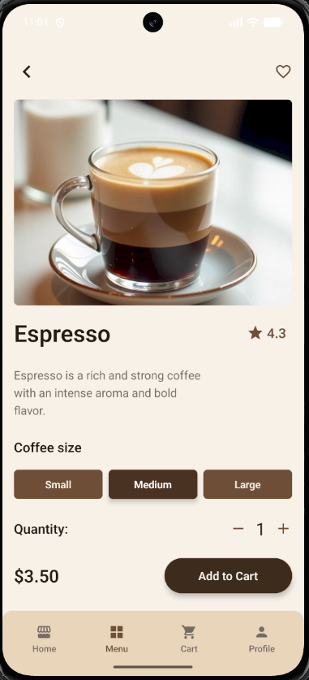

# Cross Assignment 4

## Description

This project is a React Native coffee shop application created for Cross Assignment 4.

The application demonstrates navigation between screens using Stack Navigator, Bottom Tab Navigator and Drawer Navigator.

## Navigation Structure

The application uses several navigation types:

- Stack Navigator
- Bottom Tab Navigator
- Drawer Navigator

Navigation structure:

```text
Welcome
↓
Drawer Navigator
├── Home
│   └── Bottom Tab Navigator
│       ├── Home Stack
│       │   ├── Home
│       │   └── Coffee Details
│       ├── Menu Stack
│       │   ├── Menu
│       │   └── Coffee Details
│       ├── Cart Stack
│       │   ├── Cart
│       │   └── Checkout
│       └── Profile
├── Settings
├── About Us
└── Contact Us
```

## Features

- Welcome screen
- Home screen
- Coffee menu
- Coffee details
- Product size selection
- Different prices for Small, Medium and Large drinks
- Product quantity selection
- Add products to cart
- Remove products from cart
- Cart total calculation
- Checkout screen
- Bottom Tab navigation
- Drawer navigation
- Stack navigation
- Custom navigation headers
- Navigation icons
- Back navigation
- Drawer swipe gesture
- Product ID passing between screens
- Error handling when product ID is missing

## Data Passing

Product information is passed to the Coffee Details screen using:

```js
navigation.navigate(SCREENS.COFFEE_DETAILS, {
  productId: product.id,
});
```

The parameter is received using:

```js
const {productId} = route.params || {};
```

If the product ID is missing or incorrect, the application displays:

```text
Product not found
```

instead of crashing.

## Technologies

- React Native
- React Navigation
- Native Stack Navigator
- Bottom Tab Navigator
- Drawer Navigator
- React Context
- React Native Vector Icons
- React Native Safe Area Context

## Testing

The application was tested on an Android emulator.

The following functionality was tested:

- Navigation between all screens
- Bottom Tab navigation
- Drawer navigation
- Drawer swipe gesture
- Stack navigation
- Back navigation
- Product ID passing
- Missing product ID handling
- Coffee size selection
- Price changes depending on drink size
- Quantity selection
- Adding products to cart
- Removing products from cart
- Checkout calculations

SafeAreaView is used to support different screen areas and system UI.

## Screenshots

### Welcome Screen


### Home Screen


### Menu Screen


### Coffee Details



### Cart


### Checkout


### Drawer


## Demo Video

A short video demonstrating the application navigation and main functionality:

[Watch Demo Video](./src/assets/video/app_demo.mp4)

## Run Project

Install dependencies:

```bash
npm install
```

Start Metro:

```bash
npx react-native start
```

Run the Android application:

```bash
npx react-native run-android
```