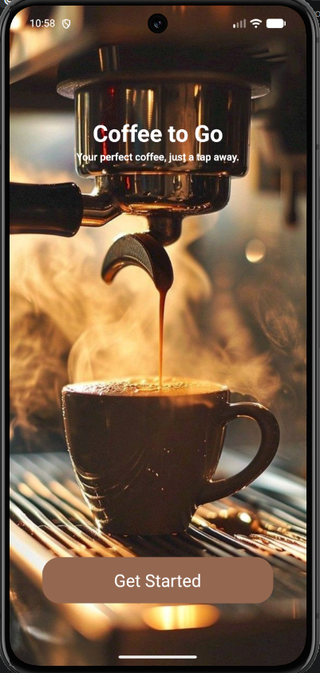
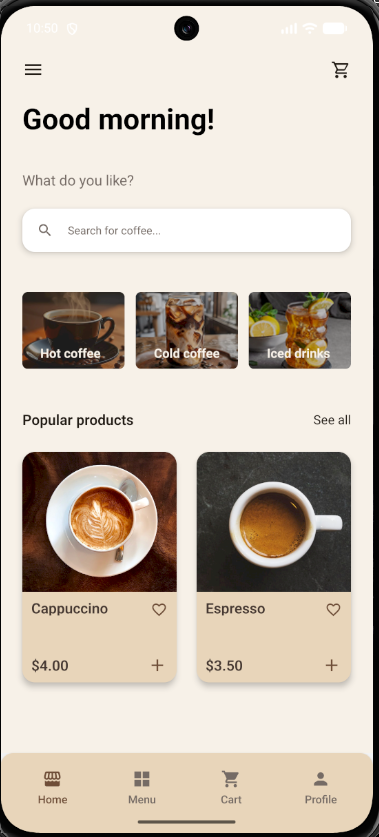
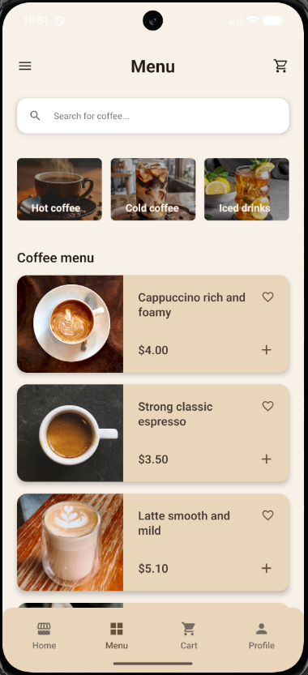
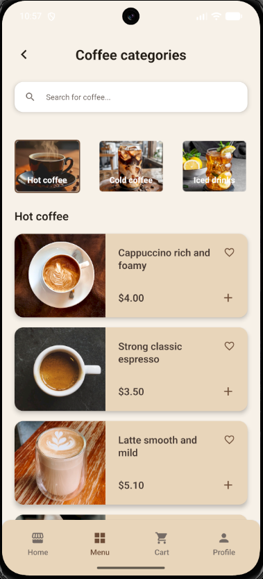
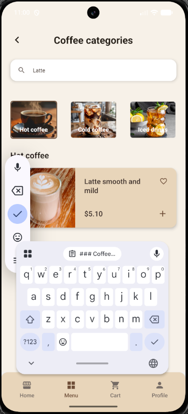
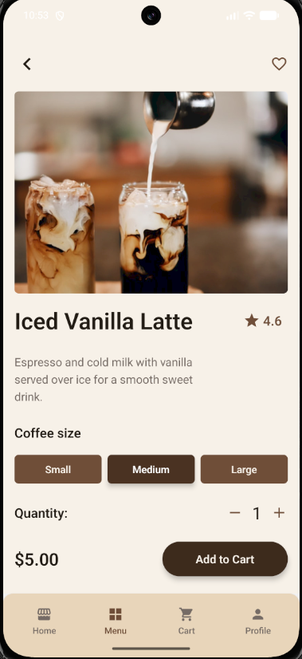
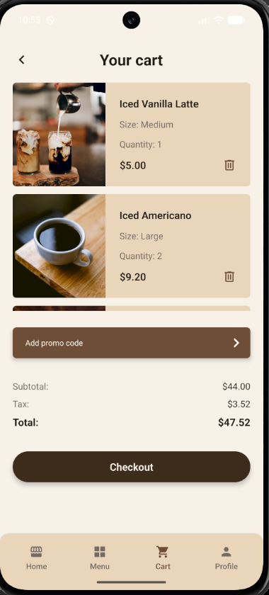
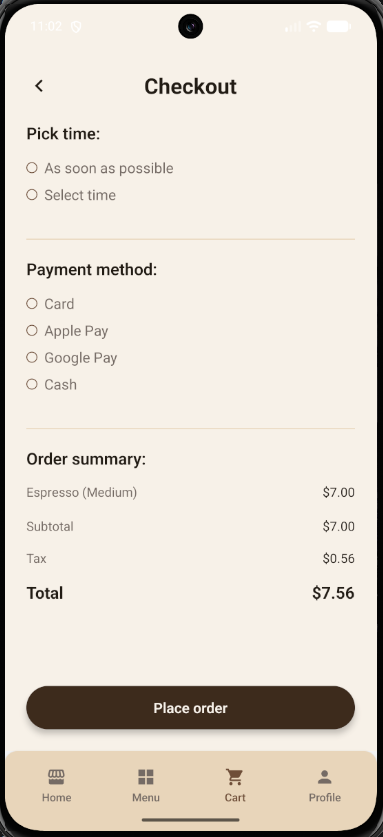
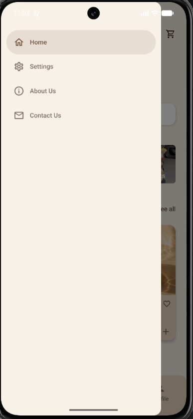

# Cross Assignment 5

## Опис

CoffeeToGo — це мобільний застосунок кав'ярні, розроблений за допомогою React Native.

Для навігації в застосунку використовуються Stack Navigator, Bottom Tab Navigator та Drawer Navigator. Дані про продукти завантажуються з REST API за допомогою Fetch API та динамічно відображаються в застосунку.

Ця версія проєкту демонструє інтеграцію REST API, асинхронне завантаження даних, відображення списків за допомогою FlatList, стани завантаження та помилки, фільтрацію за категоріями та навігацію до детальної інформації про продукт.

## Структура навігації

У застосунку використовуються декілька типів навігації:

- Stack Navigator
- Bottom Tab Navigator
- Drawer Navigator

Структура навігації:

```text
Welcome
↓
Drawer Navigator
├── Home
│   └── Bottom Tab Navigator
│       ├── Home Stack
│       │   ├── Home
│       │   ├── Popular Products
│       │   ├── Category Products
│       │   └── Coffee Details
│       ├── Menu Stack
│       │   ├── Menu
│       │   ├── Category Products
│       │   └── Coffee Details
│       ├── Cart Stack
│       │   ├── Cart
│       │   └── Checkout
│       └── Profile
├── Settings
├── About Us
└── Contact Us
```

## Функціональність

- Екран привітання
- Головний екран
- Меню кави
- Детальна інформація про каву
- Інтеграція REST API
- Завантаження даних про продукти з MockAPI
- GET-запити за допомогою Fetch API
- Відображення продуктів за допомогою FlatList
- Індикатор завантаження під час отримання даних
- Обробка помилок при невдалих API-запитах
- Популярні продукти
- Фільтрація продуктів за категоріями
- Пошук на екранах категорій і популярних продуктів
- Категорії Hot, Cold та Iced
- Навігація від категорій до відфільтрованих списків продуктів
- Навігація зі списків продуктів до Coffee Details
- Завантаження зображень продуктів з API
- Вибір розміру напою
- Різні ціни для розмірів Small, Medium та Large
- Вибір кількості продукту
- Додавання продуктів до кошика
- Видалення продуктів із кошика
- Розрахунок загальної суми кошика
- Екран оформлення замовлення
- Bottom Tab навігація
- Drawer навігація
- Stack навігація
- Власні заголовки навігації
- Іконки навігації
- Навігація назад
- Відкриття Drawer жестом
- Передача ID та даних продукту між екранами

## Інтеграція API

Дані про продукти завантажуються з REST API, створеного за допомогою MockAPI.

URL API зберігається у змінній середовища та не додається безпосередньо до Git-репозиторію.

Логіка API-запиту винесена в окремий файл:

```text
src/api/api.js
```

Продукти завантажуються за допомогою GET-запиту через Fetch API:

```js
import { API_URL } from '@env';

// GET-запит для завантаження всіх продуктів з MockAPI
export const fetchProducts = async () => {
  const response = await fetch(API_URL);

  if (!response.ok) {
    throw new Error('Failed to fetch products');
  }

  const data = await response.json();

  return data;
};
```

Отримані дані зберігаються у стані компонентів за допомогою `useState`.

`useEffect` використовується для завантаження продуктів під час відкриття відповідного екрана.

## Список продуктів

Продукти, отримані з API, відображаються за допомогою React Native `FlatList`.

Для списку продуктів використовуються:

- `data` для продуктів, отриманих з API
- `renderItem` для відображення карток продуктів
- `keyExtractor` для унікальних ключів елементів списку
- `HorizontalProductCard` як повторно використовуваний власний компонент

Кожен продукт можна вибрати, щоб відкрити екран Coffee Details.

## Завантаження та обробка помилок

Поки дані про продукти завантажуються, застосунок відображає `ActivityIndicator`.

Якщо API-запит завершується помилкою, застосунок відображає:

```text
Failed to load products
```

Це запобігає аварійному завершенню роботи застосунку, якщо API або мережа недоступні.

## Передача даних

Коли користувач вибирає продукт, його ID та дані передаються на екран Coffee Details:

```js
navigation.navigate(SCREENS.COFFEE_DETAILS, {
  productId: item.id,
  product: item,
});
```

Дані продукту отримуються на екрані Coffee Details через параметри маршруту:

```js
const { product } = route.params || {};
```

Якщо дані продукту відсутні, застосунок відображає:

```text
Product not found
```

замість аварійного завершення роботи.

## Технології

- React Native
- JavaScript
- React Navigation
- Native Stack Navigator
- Bottom Tab Navigator
- Drawer Navigator
- Fetch API
- MockAPI
- React Context
- React Native Vector Icons
- React Native Safe Area Context
- react-native-dotenv

## Тестування

Застосунок було протестовано на Android-емуляторі.

Було перевірено таку функціональність:

- Завантаження продуктів через REST API
- Стан завантаження
- Обробка помилок API
- Відображення продуктів за допомогою FlatList
- Навігація між усіма екранами
- Bottom Tab навігація
- Drawer навігація
- Відкриття Drawer жестом
- Stack навігація
- Навігація назад
- Передача ID та даних продукту
- Фільтрація за категоріями
- Популярні продукти
- Пошук на екранах категорій та популярних продуктів
- Віддалені зображення продуктів з API
- Вибір розміру кави
- Зміна ціни залежно від розміру напою
- Вибір кількості
- Додавання продуктів до кошика
- Видалення продуктів із кошика
- Розрахунок суми кошика

Проєкт також було перевірено за допомогою ESLint без помилок та попереджень.

SafeAreaView використовується для коректного відображення інтерфейсу з урахуванням системних областей екрана.

## Скріншоти

### Welcome Screen



### Home Screen



### Menu Screen



### Coffee Categories



### Coffee Categories Search



### Coffee Details



### Cart



### Checkout



### Drawer



## Демонстраційне відео

Коротке відео, яке демонструє навігацію та основну функціональність застосунку:

[Переглянути демонстраційне відео](./src/assets/video/app-demo-5.mp4)

## Змінні середовища

Створіть файл `.env` у кореневій папці проєкту:

```env
API_URL=YOUR_MOCKAPI_PRODUCTS_URL
```

Файл `.env` виключений з Git за допомогою `.gitignore`.

## Запуск проєкту

Встановіть залежності:

```bash
npm install
```

Створіть файл `.env` у кореневій папці проєкту:

```env
API_URL=YOUR_MOCKAPI_PRODUCTS_URL
```

Запустіть Metro:

```bash
npx react-native start
```

Запустіть Android-застосунок:

```bash
npx react-native run-android
```